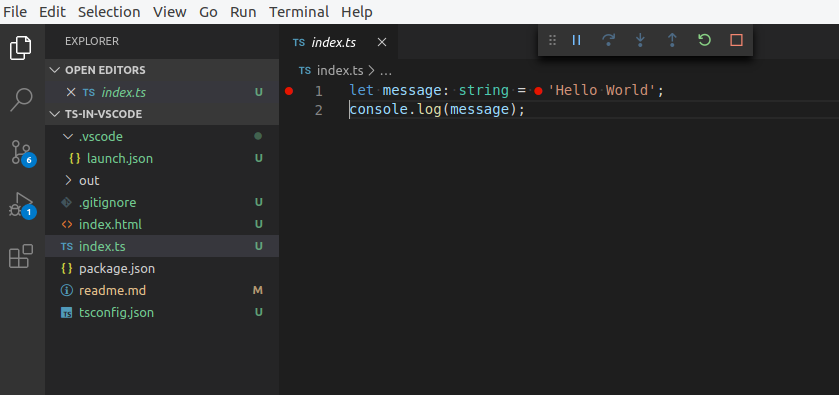

# Typescript on VSCode

Esta foi a primeira tentativa de debugar no Chrome a partir do vscode.

Eu criei um aplicação bem simples.

- https://code.visualstudio.com/docs/typescript/typescript-tutorial
- https://code.visualstudio.com/docs/typescript/typescript-compiling
- https://code.visualstudio.com/docs/typescript/typescript-debugging

Instalei o http-server `npm install http-server --save-dev`.

### Debugando

Inicie o servidor

    node node_modules/http-server/bin/http-server

Como já temos o vscode devidamente configurado, basta acinonar `F5`.

O Chrome deve abrir automaticamente.

Coloque algum breakpoint e divirtase.

### Desafios

A configuração no arquivo `/.vscode/launch.json` é a dica "matadora".

    "runtimeArgs": [
        "--new-window",
        "-user-data-dir=\"/${workspaceFolder}/DevProfile\"",
        "--remote-debugging-port=9222",
        "--disable-background-networking"
    ],

Igualmente importante, foi saber onde estava instalado o Chrome (chromiun) no Linux.

    $ which chromium-browser
    /usr/bin/chromium-browser

O comando acima retornou (na minha máquina) o caminho do navegador, então pude corrigir o
arquivo `launch.json`.

      "runtimeExecutable": "/usr/bin/chromium-browser",

O que "salvou a lavoura" foram as dicas nos artigos abaixo.

## Dicas de configuração

- https://medium.com/@JSantaCL/how-to-debug-an-angular-app-using-vs-code-and-chromium-7eb60b0b0cee

## Onde está instalado o Chrome ?

- https://askubuntu.com/questions/839298/default-installation-path-for-chromium-web-browser-in-ubuntu-16-04
- https://stackoverflow.com/questions/13928620/how-to-set-path-for-chromium-browser-in-sublimetext2s-slidebar-enhancement-plug

